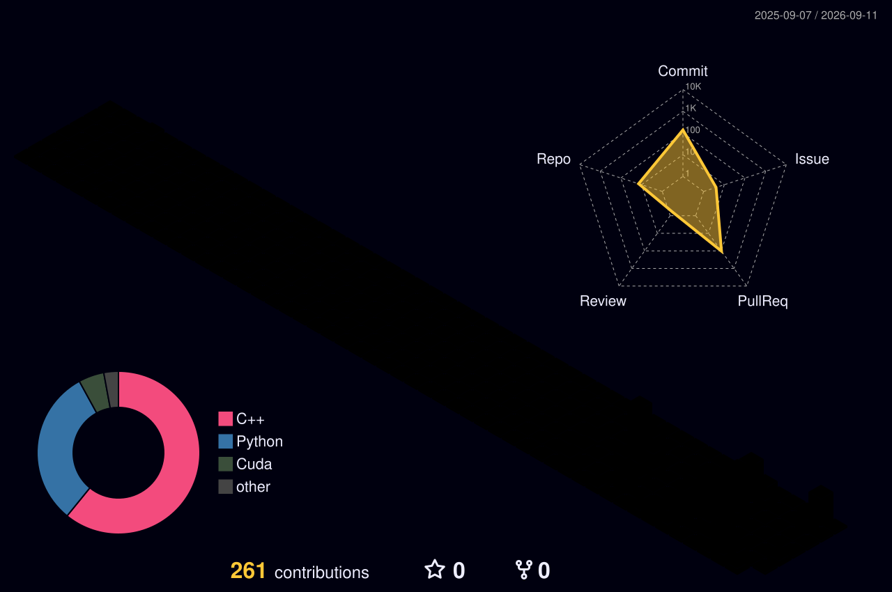

 

I build and study **AI infrastructure** through CUDA kernel optimization, LLM serving systems, and reproducible performance experiments.

北京交通大学学生，正在学习并实践 **AI Infra、CUDA 内核优化、LLM 推理服务与可复现性能评测**。

---

## Current Focus

| | Area | What I am working on |
|:--:|---|---|
| ⚡ | **Inference Systems** | Continuous batching, Paged KV cache, prefix caching, scheduling, and OpenAI-compatible serving. |
| 🧩 | **CUDA Optimization** | SGEMM and custom kernels, memory hierarchy, launch configuration, and architecture-aware tuning. |
| 📈 | **Performance Engineering** | CUDA Events, Nsight Systems/Compute, fair benchmarks, correctness gates, and reproducible evidence. |
| 🤖 | **AI Agents & Benchmarks** | Profile-guided optimization agents, Work/Judge evaluation, and benchmark-authoring workflows. |

## Selected Work

| Project | Focus | Highlights |
|---|---|---|
| [**nano-vllm-online-serving**](https://github.com/shunwendongan/nano-vllm-online-serving) | LLM serving | Continuous batching, Paged KV cache, prefix-cache diagnostics, streaming APIs, and benchmark reports. |
| [**CUDA-SGEMM-Lab**](https://github.com/shunwendongan/CUDA-SGEMM-Lab) | CUDA kernels | Progressive SGEMM optimization and reproducible RTX 3080 benchmarking. |
| [**sebench-ai-infra-replica**](https://github.com/shunwendongan/sebench-ai-infra-replica) | Agent evaluation | Public-paper-inspired Work/Judge evaluation, benchmark authoring, MLX/MPS notes, and experiment tracking. |
| [**KernelBlaster**](https://github.com/shunwendongan/KernelBlaster) | Research fork | An extended research fork for correctness-first, profile-guided CUDA optimization with persistent experiment evidence. |

## Tech Stack

**Languages**

**GPU & ML**

**Systems & Tooling**

## GitHub Stats

<picture>
  <source media="(prefers-color-scheme: dark)" srcset="https://github-readme-stats.vercel.app/api?username=shunwendongan&amp;show_icons=true&amp;hide_border=true&amp;bg_color=0D1117&amp;title_color=22D3EE&amp;text_color=C9D1D9&amp;icon_color=8B5CF6" />
  <source media="(prefers-color-scheme: light)" srcset="https://github-readme-stats.vercel.app/api?username=shunwendongan&amp;show_icons=true&amp;hide_border=true&amp;bg_color=FFFFFF&amp;title_color=6D28D9&amp;text_color=24292F&amp;icon_color=0891B2" />
  
</picture>
<picture>
  <source media="(prefers-color-scheme: dark)" srcset="https://github-readme-stats.vercel.app/api/top-langs/?username=shunwendongan&amp;layout=compact&amp;langs_count=8&amp;hide_border=true&amp;bg_color=0D1117&amp;title_color=22D3EE&amp;text_color=C9D1D9" />
  <source media="(prefers-color-scheme: light)" srcset="https://github-readme-stats.vercel.app/api/top-langs/?username=shunwendongan&amp;layout=compact&amp;langs_count=8&amp;hide_border=true&amp;bg_color=FFFFFF&amp;title_color=6D28D9&amp;text_color=24292F" />
  
</picture>

## Contributions

<picture>
  <source media="(prefers-color-scheme: dark)" srcset="./dist/github-snake-dark.svg" />
  <source media="(prefers-color-scheme: light)" srcset="./dist/github-snake.svg" />
  
</picture>

 

<picture>
  <source media="(prefers-color-scheme: dark)" srcset="./profile-3d-contrib/profile-night-rainbow.svg" />
  <source media="(prefers-color-scheme: light)" srcset="./profile-3d-contrib/profile-season-animate.svg" />
  
</picture>

---

**Measure. Profile. Optimize. Verify.**

